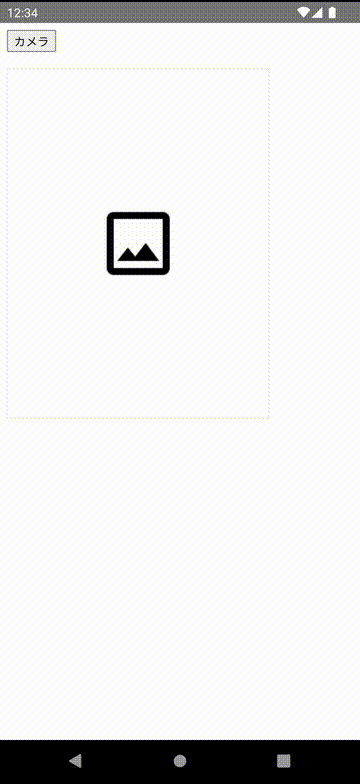

# AndroidWebViewDemo

WebView と Android ネイティブの連携のデモアプリです。

ローカルの HTML を WebView で読み込み、HTML のボタンがクリックされたらネイティブ側でカメラを起動します。
カメラ撮影したら撮影した画像を HTML で表示しています。

主に以下の機能を使っています。

- スクリプトは TypeScript で実装
  - カスタムの Gradle Plugin によって、ビルド時に TypeScript を JavaScript に変換し assets ディレクトリにファイルを配置
- [WebViewAssetLoader](https://developer.android.com/reference/androidx/webkit/WebViewAssetLoader) を使って Android のネイティブ側のリソースを HTML で表示する
- Android <-> JavaScript の連携
    - Android から JavaScript の実行
    - JavaScript から Android に文字列を送る
